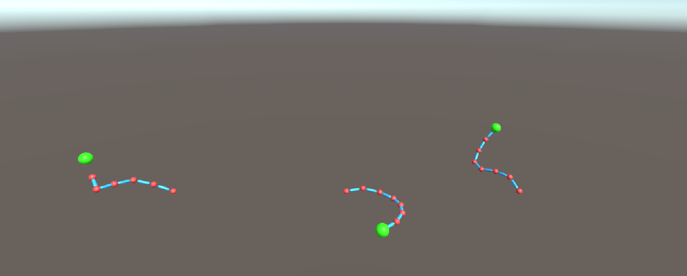
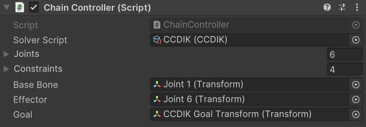
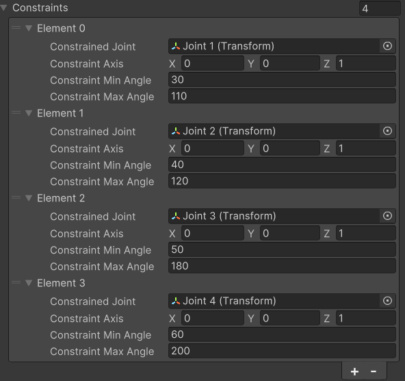
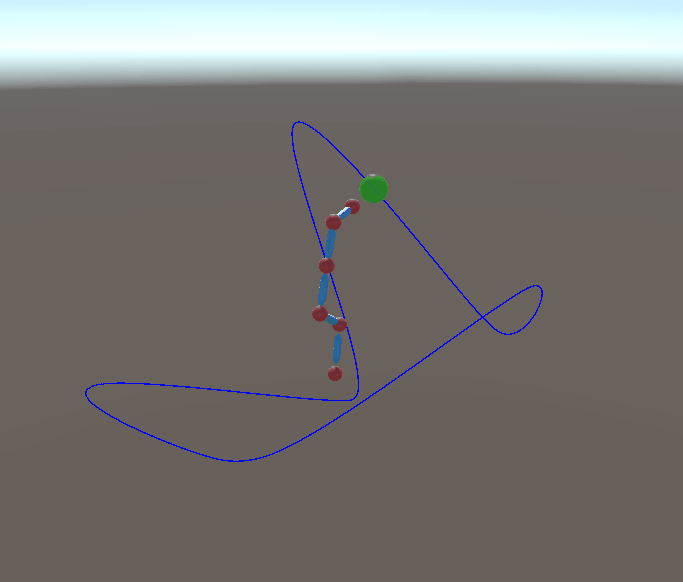
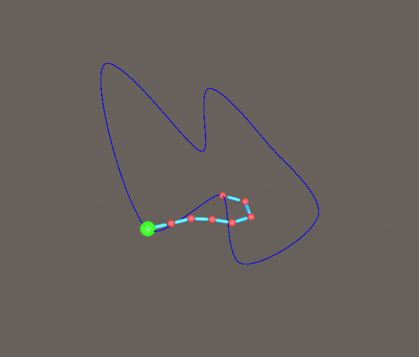
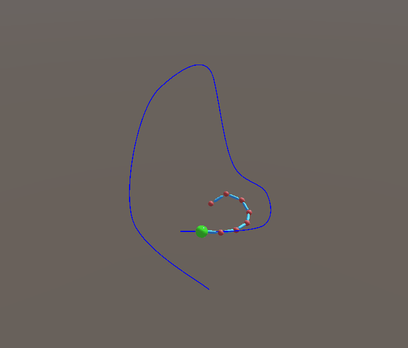

# Inverse Kinematics - **Unity/C#**
### ISART DIGITAL MGP1, School Project: *Rémi GINER*

<!-- ABOUT THE PROJECT -->
# About The Project 

The goal of this project is to develop a tool to create, edit and use inverse kinematics solvers. I made the choice to develop the Cyclic Coordinate Descent Inverse Kinematics (CCDIK) and the Forward And Backward Reaching Inverse Kinematics (FABRIK) solvers.

# Table of contents
1. [Features](#features)
2. [Controls](#controls)
3. [Details](#details)
    - [Technical Implementation](#technical-implementation)
    - [Overview Implementation](#overview-implementation)
4. [In the future](#itf)
5. [References](#references)
6. [Versionning](#versionning)
7. [Autor](#author)

# Features
- CCDIK, FABRIK
- Constraints for CCDIK

# Controls
There is no character controller, to navigate in the scene you have to use the scene viewer no clip mode.

# Details
## Technical Implementation

### **Inverse Kinematics Controller**
To have a proper control on the rig, I had to create a Controller that gathers information on the joints, the bones and the target goal to be able to evaluate the requested information according to the input solver.

The inverse kinematics controller is responsible for gathering the items that will be interpreted by the controller solver. For example, the default controller is able to create a chain of joints using two joints sharing the same parent hierarchy.

The controller can also perform post-solve calculations like the Chain Controller which reorients and readjusts the positions of bones related to joints.

Inspector view of the ChainController.

#### **Constraints**
The constraint model is inspired by the Unreal implementation of inverse kinematics where each joint can have a constraint. These constraints are stored in a list external to the original joints list. When constraints must be applied, they are retrieved using the current joint from the list of constraints.

> **_NOTE:_**  For the moment, the constraints are only available with the CCDIK solver.

Inspector view of the constraints on the Controller.

### **Inverse Kinematics Descriptor**

To make the code more open, the algorithms managing the behavior of the IK are coded in ScriptableObjects, so that they can be changed at any time in the Inverse Kinematics Controller. In this demo, the CCDIK and the FABRIK solvers have been implemented. The CCDIK solver supports constraints and the FABRIK solver has a clamp/unclamped mode that modifies its behavior.

CCDIK|Clamped FABRIK|Unclamped FABRIK
:-:|:-:|:-:
||

At the start of the game, an instance of the solver ScriptableObject is created to avoid modifying variables shared by all solvers. This instance is initialized with the controller joints and constraints, it can helps some solvers to do precomputing such as the FABRIK solver. 

## Overview Implementation

The Overview uses Unity's Spline package, which really helps create splines easily. It also offers the use of the Spline Animator which is a script that allows a GameObject to follow a spline. The target goal of each arm moves using a looping Spline animator.

## In the future:
In the future, all this code will surely be ported to C++ on an house-made engine. More solvers such as the Jacobian Inverse Kinematics will be developed.

## References:
CCDIK:
- https://core.ac.uk/download/pdf/82473611.pdf
- https://rodolphe-vaillant.fr/entry/114/cyclic-coordonate-descent-inverse-kynematic-ccd-ik
- https://zalo.github.io/blog/inverse-kinematics/

FABRIK:
- https://www.youtube.com/watch?v=UNoX65PRehA
- http://andreasaristidou.com/FABRIK.html
- http://www.root-motion.com/finalikdox/html/page6.html
- https://www.researchgate.net/publication/220632147_FABRIK_A_fast_iterative_solver_for_the_Inverse_Kinematics_problem
- https://medium.com/unity3danimation/create-your-own-ik-in-unity3d-989debd86770

## Versionning
Git Lab for the versioning.

# Author

